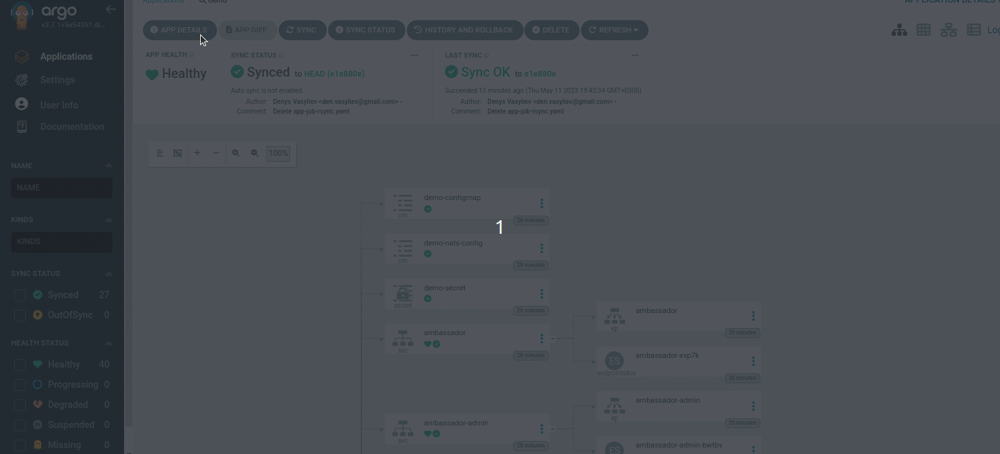

## Installation

```bash
    k3s cluster create argo
    k3s kubectl get all -n argocd
    k3s kubectl get po -n argocd -w
    k3s kubectl port-forward svc/argocd-server -n argocd 8080:443&
```
 Open localhost:8080 in your browser and login.

 Here you can add and manage your app.


[]()
